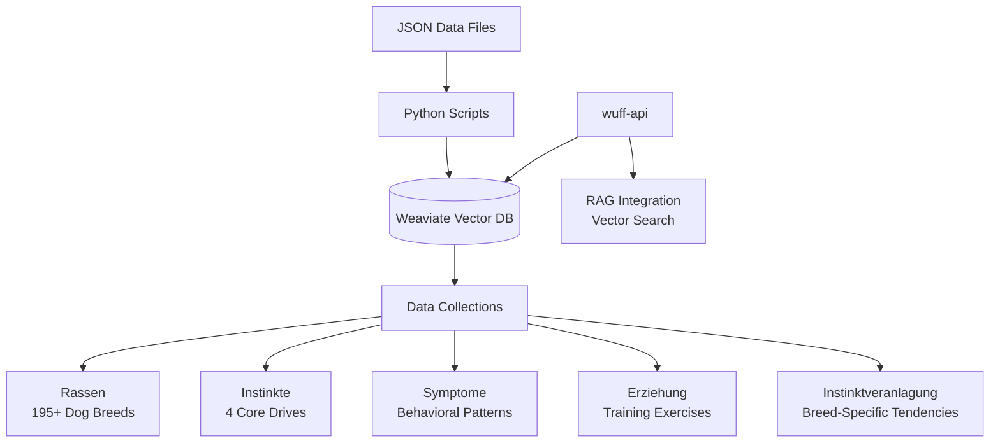

# WuffChat Knowledge Base & Data Management

**Production**: Weaviate vector database | **Content**: 195+ dog breeds, behavioral patterns, training exercises

Vector database management system for WuffChat's AI-powered dog behavior consultation platform, providing structured canine knowledge through Weaviate integration.

## Technical Architecture



### Core Collections
- **Rassen**: 195+ dog breeds with characteristics, temperament, and care requirements
- **Instinkte**: Four fundamental canine drives (Jagd, Territorial, Rudel, Sexual)
- **Symptome**: Behavioral symptoms mapped to underlying instincts and root causes
- **Erziehung**: Training exercises and solutions matched to specific instincts
- **Instinktveranlagung**: Breed predispositions for instinctual behaviors
- **Allgemein**: General canine knowledge and behavioral principles

## Data Management

### Environment Setup

```bash
# Setup Python environment
python -m venv venv
source venv/bin/activate  # or `venv\Scripts\activate` on Windows
pip install -r requirements.txt

# Configure environment
cp .env.template .env
# Edit .env with your credentials:
# - WEAVIATE_URL (your Weaviate cluster URL)  
# - WEAVIATE_API_KEY (your Weaviate API key)
# - OPENAI_APIKEY (your OpenAI API key for vectorization)
```

### Database Operations

```bash
# Complete setup with all data collections
python scripts/setup_dogbot_weaviate.py

# Import specific data types
python scripts/weaviate_data_import.py --collection rassen
python scripts/weaviate_data_import.py --collection instinkte

# Validate data integrity
python scripts/validate_data.py

# View available options and help
python scripts/setup_dogbot_weaviate.py --help
```

## Content-as-Code Philosophy

### Structured Data Management
- **Version Control**: All knowledge base content stored as JSON files in Git
- **Schema Validation**: Pydantic models ensure data consistency
- **Atomic Updates**: Scripts support incremental updates without data loss
- **Rollback Support**: Git history enables easy content rollbacks

### Data Structure Example
```json
{
  "name": "German Shepherd",
  "eigenschaften": {
    "groesse": "groß",
    "fell": "mittellang, doppelt",
    "lebenserwartung": "9-13 Jahre"
  },
  "instinktveranlagung": {
    "jagd": 7,
    "territorial": 9, 
    "rudel": 8,
    "sexual": 6
  },
  "verhalten": {
    "aktivitaetslevel": "hoch",
    "sozialverhalten": "loyal, schützend"
  }
}
```

## Vector Search Integration

### RAG Implementation
- **Semantic Search**: Context-aware breed and behavior matching
- **Instinct Mapping**: Automatic linking of behaviors to underlying drives  
- **Solution Retrieval**: Training exercises matched to specific problems
- **Multilingual Support**: German content with English technical interfaces

### Query Examples
```python
# Find breeds suitable for specific behaviors
results = client.query.get("Rassen").with_near_text({
    "concepts": ["ruhig", "familienfreundlich", "wenig haaren"]
}).with_limit(5).do()

# Retrieve training exercises for instinct-based behaviors
exercises = client.query.get("Erziehung").with_where({
    "path": ["instinkt"],
    "operator": "Equal", 
    "valueString": "Jagd"
}).do()
```

## Security & Best Practices

### Environment Security
- **API Keys**: Environment variables only, never committed
- **Access Control**: Weaviate cluster with authentication enabled
- **Validation**: Input sanitization for all data operations
- **Backup Strategy**: Regular exports and version control

### Data Quality Assurance
- **Schema Validation**: Automated checks during import
- **Content Review**: Manual verification of behavioral accuracy
- **Expert Validation**: Canine behavior specialist review process
- **Continuous Updates**: Regular content updates based on new research

---

**Back to WuffChat meta-repository** - see [wuffchat](https://github.com/kemperfekt/wuffchat) for complete overview